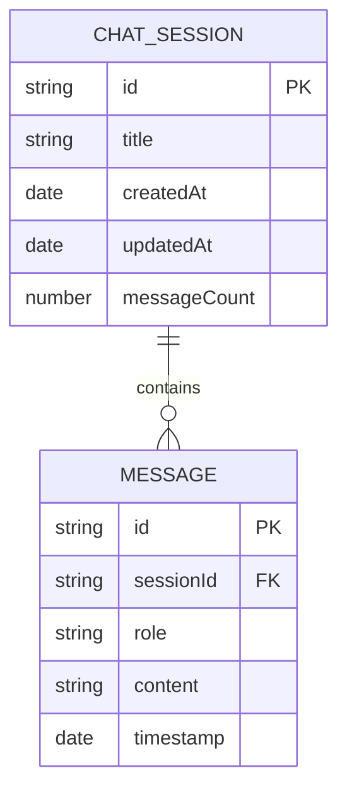

# Chat History Sidebar Drawer - Technical Architecture Document

## 1. Architecture Design

```mermaid
graph TD
  A[React Native App] --> B[Sidebar Drawer Component]
  A --> C[Global Store (Zustand)]
  A --> D[AsyncStorage]
  B --> E[Chat Session List]
  B --> F[Animation Controller]
  C --> G[Chat State Management]
  C --> H[Sidebar State Management]
  D --> I[Persistent Chat History]
  F --> J[React Native Reanimated]
  
  subgraph "UI Layer"
    B
    E
  end
  
  subgraph "State Management"
    C
    G
    H
  end
  
  subgraph "Storage Layer"
    D
    I
  end
  
  subgraph "Animation Layer"
    F
    J
  end
```

## 2. Technology Description
- Frontend: React Native + TypeScript + React Native Reanimated 3
- State Management: Zustand (existing global store)
- Storage: AsyncStorage for chat history persistence
- Animation: React Native Reanimated 3 + Gesture Handler
- Icons: Lucide React Native (existing)

## 3. Route Definitions

| Route | Purpose |
|-------|----------|
| /(app)/index | Main chat screen with integrated sidebar drawer |
| /(app)/_layout | App layout with sidebar state management |

## 4. Component Architecture

### 4.1 Core Components

**SidebarDrawer Component**
```typescript
interface SidebarDrawerProps {
  isVisible: boolean;
  onClose: () => void;
  chatSessions: ChatSession[];
  currentChatId: string;
  onSelectChat: (chatId: string) => void;
  onDeleteChat: (chatId: string) => void;
}
```

**ChatSessionItem Component**
```typescript
interface ChatSessionItemProps {
  session: ChatSession;
  isActive: boolean;
  onSelect: () => void;
  onDelete: () => void;
}
```

**MenuButton Component**
```typescript
interface MenuButtonProps {
  isOpen: boolean;
  onPress: () => void;
}
```

### 4.2 State Management Extensions

**Global Store Extensions**
```typescript
interface ChatHistoryState {
  // Sidebar state
  sidebarVisible: boolean;
  setSidebarVisible: (visible: boolean) => void;
  
  // Chat sessions
  chatSessions: ChatSession[];
  addChatSession: (session: ChatSession) => void;
  deleteChatSession: (sessionId: string) => void;
  updateChatSession: (sessionId: string, updates: Partial<ChatSession>) => void;
  
  // Storage operations
  loadChatHistory: () => Promise<void>;
  saveChatHistory: () => Promise<void>;
}
```

## 5. Data Model

### 5.1 Data Model Definition



### 5.2 Data Definition Language

**ChatSession Interface**
```typescript
interface ChatSession {
  id: string;
  title: string;
  createdAt: Date;
  updatedAt: Date;
  messageCount: number;
  messages: UIMessage[];
}
```

**UIMessage Interface (existing)**
```typescript
interface UIMessage {
  id: string;
  role: 'user' | 'assistant' | 'system';
  content: string;
  timestamp?: Date;
}
```

**AsyncStorage Schema**
```typescript
// Storage keys
const STORAGE_KEYS = {
  CHAT_SESSIONS: '@chat_sessions',
  CURRENT_CHAT_ID: '@current_chat_id'
};

// Storage operations
const saveChatSessions = async (sessions: ChatSession[]) => {
  await AsyncStorage.setItem(STORAGE_KEYS.CHAT_SESSIONS, JSON.stringify(sessions));
};

const loadChatSessions = async (): Promise<ChatSession[]> => {
  const data = await AsyncStorage.getItem(STORAGE_KEYS.CHAT_SESSIONS);
  return data ? JSON.parse(data) : [];
};
```

## 6. Animation Implementation

### 6.1 Sidebar Animation
```typescript
// Reanimated shared values
const translateX = useSharedValue(-SIDEBAR_WIDTH);
const opacity = useSharedValue(0);

// Animation functions
const showSidebar = () => {
  translateX.value = withTiming(0, { duration: 300 });
  opacity.value = withTiming(0.5, { duration: 300 });
};

const hideSidebar = () => {
  translateX.value = withTiming(-SIDEBAR_WIDTH, { duration: 300 });
  opacity.value = withTiming(0, { duration: 300 });
};
```

### 6.2 Gesture Handling
```typescript
// Pan gesture for swipe-to-close
const panGesture = Gesture.Pan()
  .onUpdate((event) => {
    if (event.translationX < 0) {
      translateX.value = Math.max(-SIDEBAR_WIDTH, event.translationX);
    }
  })
  .onEnd((event) => {
    if (event.translationX < -SIDEBAR_WIDTH * 0.3) {
      hideSidebar();
      runOnJS(onClose)();
    } else {
      showSidebar();
    }
  });
```

## 7. Integration Points

### 7.1 Header Integration
- Add MenuButton to existing header left position
- Maintain existing header functionality (voice chat, new chat)
- Animate menu button icon based on sidebar state

### 7.2 Global Store Integration
- Extend existing useStore hook with chat history methods
- Integrate with existing chatId and setChatId functionality
- Maintain compatibility with current message handling

### 7.3 Storage Integration
- Auto-save chat sessions when messages are added
- Load chat history on app initialization
- Handle storage errors gracefully with fallback states

## 8. Performance Considerations

- Use React.memo for ChatSessionItem components
- Implement virtualized list for large chat history
- Optimize animations with native driver
- Debounce storage operations to prevent excessive writes
- Lazy load chat messages when switching sessions
