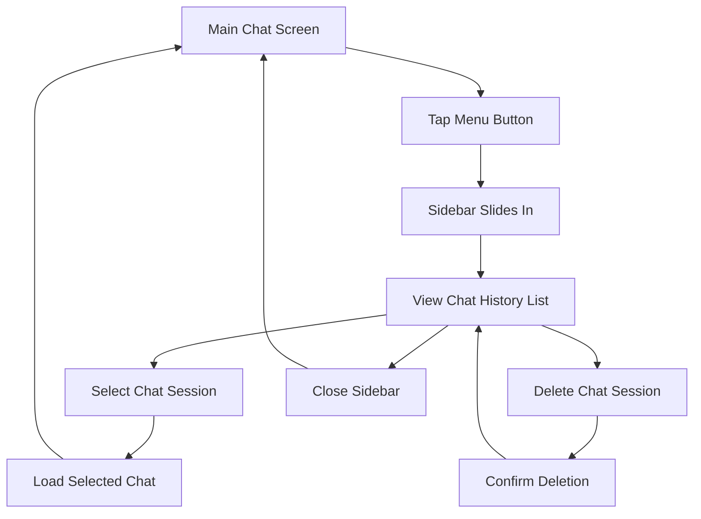

# Chat History Sidebar Drawer - Product Requirements Document

## 1. Product Overview
A collapsible animated sidebar drawer that displays chat history and allows users to navigate between different chat sessions in the expo-ai-chatbot application.
- Provides easy access to previous conversations and enables seamless switching between chat sessions
- Enhances user experience by offering persistent chat history management with intuitive navigation
- Targets mobile and tablet users who need quick access to multiple ongoing conversations

## 2. Core Features

### 2.1 User Roles
No specific user roles required - all users have the same access to chat history functionality.

### 2.2 Feature Module
Our chat history sidebar requirements consist of the following main components:
1. **Sidebar Drawer**: collapsible panel, chat session list, smooth animations
2. **Chat Session Management**: session creation, session switching, session deletion
3. **Header Integration**: menu toggle button, responsive header layout
4. **Persistent Storage**: chat history persistence, session metadata storage

### 2.3 Page Details

| Page Name | Module Name | Feature description |
|-----------|-------------|---------------------|
| Main Chat | Sidebar Drawer | Slide-in/slide-out animation from left side. Display list of chat sessions with titles and timestamps. Toggle visibility via header menu button. |
| Main Chat | Chat Session List | Show chronological list of previous conversations. Display session title (first message preview) and last activity timestamp. Support scrolling for long lists. |
| Main Chat | Session Management | Create new chat sessions automatically. Switch between existing sessions by tapping. Delete sessions with swipe-to-delete or long-press menu. |
| Main Chat | Header Integration | Add hamburger menu button to header left side. Animate button state when sidebar opens/closes. Maintain existing header functionality. |
| Main Chat | Storage Integration | Persist chat sessions to local storage. Save message history per session. Store session metadata (title, timestamp, message count). |

## 3. Core Process

**Main User Flow:**
1. User taps hamburger menu button in header
2. Sidebar slides in from left with smooth animation
3. User sees list of previous chat sessions with titles and timestamps
4. User can tap any session to switch to that conversation
5. User can swipe or long-press to delete unwanted sessions
6. User taps outside sidebar or menu button to close with slide-out animation
7. Current chat session is automatically saved when switching or creating new chats

## 4. User Interface Design

### 4.1 Design Style
- Primary colors: Follow existing app theme (white/black backgrounds)
- Secondary colors: Gray tones for timestamps and metadata
- Button style: Rounded hamburger menu icon, subtle hover/press states
- Font: System default, 16px for session titles, 12px for timestamps
- Layout style: Left-aligned sidebar overlay, card-based session items
- Animation style: Smooth slide transitions (300ms duration), subtle scale effects on interaction

### 4.2 Page Design Overview

| Page Name | Module Name | UI Elements |
|-----------|-------------|-------------|
| Main Chat | Sidebar Drawer | Semi-transparent overlay background. White/dark sidebar panel (280px width). Smooth slide-in animation from left edge. Drop shadow for depth. |
| Main Chat | Session List Items | Card-style items with rounded corners. Session title in bold, timestamp in gray. Subtle separator lines. Swipe-to-delete red background reveal. |
| Main Chat | Header Menu Button | Hamburger icon (3 horizontal lines). Smooth rotation to X when sidebar open. 24px size, proper touch target (44px). |
| Main Chat | Empty State | Centered message "No chat history yet" with subtle icon. Encouraging text to start first conversation. |

### 4.3 Responsiveness
Mobile-first design with tablet adaptation. Sidebar width adjusts based on screen size (280px mobile, 320px tablet). Touch-optimized interactions with proper gesture handling. Smooth animations optimized for 60fps performance.
