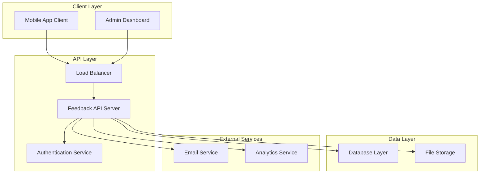
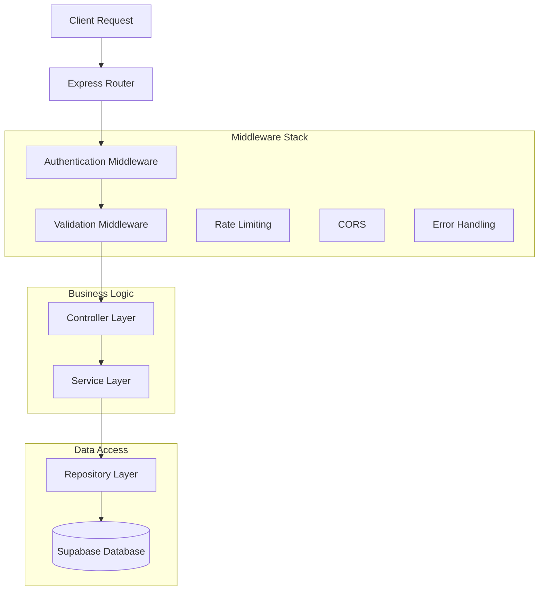
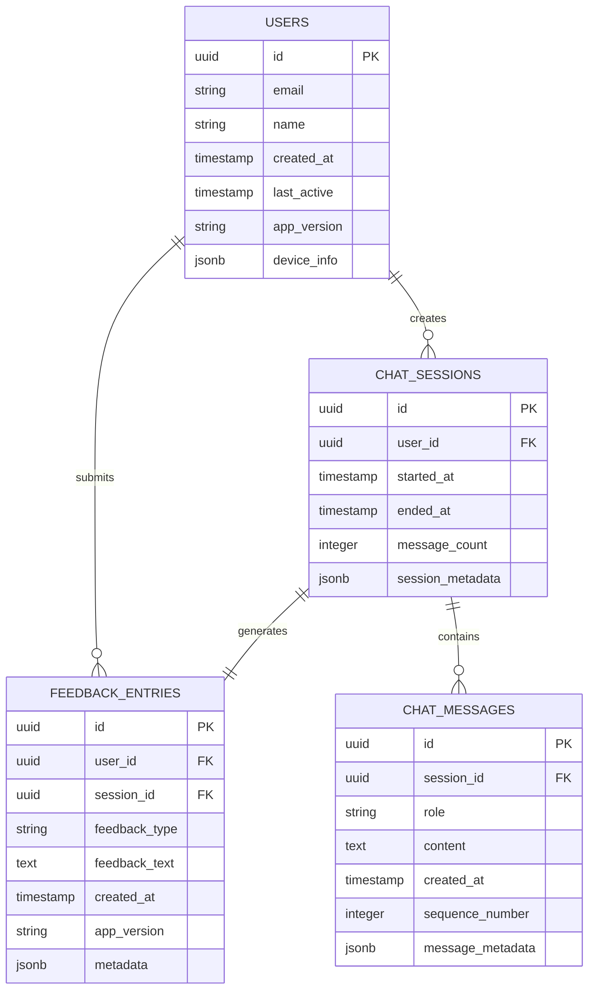

# Feedback Server Technical Architecture

## 1. Architecture Design



## 2. Technology Description

- Frontend (Mobile): React Native + Expo + TypeScript
- Frontend (Admin): React@latest + Next.js@latest + TypeScript + Tailwind CSS
- Backend: Node.js@latest + Express@latest + TypeScript
- Database: Supabase (PostgreSQL)
- Authentication: Supabase Auth
- File Storage: Supabase Storage
- Deployment: Coolify + Supabase (Database)

## 3. Route Definitions

### Mobile App Routes
| Route | Purpose |
|-------|----------|
| /chat | Main chat interface with integrated feedback buttons |
| /settings | App settings and user preferences |

### Admin Dashboard Routes
| Route | Purpose |
|-------|----------|
| /admin | Admin dashboard home with feedback analytics |
| /admin/feedback | Detailed feedback management and filtering |
| /admin/transcripts | Chat transcript viewer and search |
| /admin/analytics | Advanced analytics and reporting |
| /admin/login | Admin authentication page |

## 4. API Definitions

### 4.1 Core API

**Feedback Submission**
```
POST /api/feedback
```

Request:
| Param Name | Param Type | isRequired | Description |
|------------|------------|------------|-------------|
| userId | string | true | Unique user identifier |
| feedbackType | string | true | 'positive', 'negative', or 'detailed' |
| feedbackText | string | false | User's detailed feedback (required for 'detailed' type) |
| chatTranscript | UIMessage[] | true | Complete chat session messages |
| sessionId | string | true | Unique chat session identifier |
| timestamp | string | true | ISO timestamp of feedback submission |
| appVersion | string | true | Mobile app version for debugging |
| deviceInfo | object | false | Device metadata for analytics |

Response:
| Param Name | Param Type | Description |
|------------|------------|-------------|
| success | boolean | Submission status |
| feedbackId | string | Unique feedback entry ID |
| message | string | Success/error message |

Example Request:
```json
{
  "userId": "user_123",
  "feedbackType": "negative",
  "feedbackText": "The AI response was not helpful for my query",
  "chatTranscript": [
    {
      "id": "msg_1",
      "role": "user",
      "content": "How do I reset my password?",
      "timestamp": "2024-01-15T10:30:00Z"
    },
    {
      "id": "msg_2",
      "role": "assistant",
      "content": "I can help you reset your password...",
      "timestamp": "2024-01-15T10:30:05Z"
    }
  ],
  "sessionId": "session_456",
  "timestamp": "2024-01-15T10:35:00Z",
  "appVersion": "1.2.3",
  "deviceInfo": {
    "platform": "ios",
    "version": "17.2"
  }
}
```

**Feedback Analytics**
```
GET /api/admin/analytics
```

Request:
| Param Name | Param Type | isRequired | Description |
|------------|------------|------------|-------------|
| startDate | string | false | Start date for analytics (ISO format) |
| endDate | string | false | End date for analytics (ISO format) |
| feedbackType | string | false | Filter by feedback type |

Response:
| Param Name | Param Type | Description |
|------------|------------|-------------|
| totalFeedback | number | Total feedback count |
| positiveCount | number | Positive feedback count |
| negativeCount | number | Negative feedback count |
| averageRating | number | Overall satisfaction score |
| trends | object[] | Daily/weekly trend data |

**Chat Transcript Search**
```
GET /api/admin/transcripts
```

Request:
| Param Name | Param Type | isRequired | Description |
|------------|------------|------------|-------------|
| page | number | false | Page number for pagination |
| limit | number | false | Results per page (max 50) |
| feedbackType | string | false | Filter by associated feedback type |
| searchQuery | string | false | Search within transcript content |
| userId | string | false | Filter by specific user |

Response:
| Param Name | Param Type | Description |
|------------|------------|-------------|
| transcripts | object[] | Array of chat transcripts with metadata |
| totalCount | number | Total matching transcripts |
| currentPage | number | Current page number |
| hasMore | boolean | Whether more results exist |

## 5. Server Architecture Diagram



## 6. Data Model

### 6.1 Data Model Definition



### 6.2 Data Definition Language

**Users Table**
```sql
-- Create users table
CREATE TABLE users (
    id UUID PRIMARY KEY DEFAULT gen_random_uuid(),
    email VARCHAR(255) UNIQUE NOT NULL,
    name VARCHAR(100),
    created_at TIMESTAMP WITH TIME ZONE DEFAULT NOW(),
    last_active TIMESTAMP WITH TIME ZONE DEFAULT NOW(),
    app_version VARCHAR(20),
    device_info JSONB
);

-- Create indexes
CREATE INDEX idx_users_email ON users(email);
CREATE INDEX idx_users_created_at ON users(created_at DESC);
```

**Feedback Entries Table**
```sql
-- Create feedback_entries table
CREATE TABLE feedback_entries (
    id UUID PRIMARY KEY DEFAULT gen_random_uuid(),
    user_id UUID REFERENCES users(id),
    session_id UUID,
    feedback_type VARCHAR(20) NOT NULL CHECK (feedback_type IN ('positive', 'negative', 'detailed')),
    feedback_text TEXT,
    created_at TIMESTAMP WITH TIME ZONE DEFAULT NOW(),
    app_version VARCHAR(20),
    metadata JSONB
);

-- Create indexes
CREATE INDEX idx_feedback_user_id ON feedback_entries(user_id);
CREATE INDEX idx_feedback_created_at ON feedback_entries(created_at DESC);
CREATE INDEX idx_feedback_type ON feedback_entries(feedback_type);
CREATE INDEX idx_feedback_session_id ON feedback_entries(session_id);
```

**Chat Sessions Table**
```sql
-- Create chat_sessions table
CREATE TABLE chat_sessions (
    id UUID PRIMARY KEY DEFAULT gen_random_uuid(),
    user_id UUID REFERENCES users(id),
    started_at TIMESTAMP WITH TIME ZONE DEFAULT NOW(),
    ended_at TIMESTAMP WITH TIME ZONE,
    message_count INTEGER DEFAULT 0,
    session_metadata JSONB
);

-- Create indexes
CREATE INDEX idx_sessions_user_id ON chat_sessions(user_id);
CREATE INDEX idx_sessions_started_at ON chat_sessions(started_at DESC);
```

**Chat Messages Table**
```sql
-- Create chat_messages table
CREATE TABLE chat_messages (
    id UUID PRIMARY KEY DEFAULT gen_random_uuid(),
    session_id UUID REFERENCES chat_sessions(id),
    role VARCHAR(20) NOT NULL CHECK (role IN ('user', 'assistant', 'system')),
    content TEXT NOT NULL,
    created_at TIMESTAMP WITH TIME ZONE DEFAULT NOW(),
    sequence_number INTEGER NOT NULL,
    message_metadata JSONB
);

-- Create indexes
CREATE INDEX idx_messages_session_id ON chat_messages(session_id);
CREATE INDEX idx_messages_created_at ON chat_messages(created_at DESC);
CREATE INDEX idx_messages_sequence ON chat_messages(session_id, sequence_number);

-- Create full-text search index for content
CREATE INDEX idx_messages_content_search ON chat_messages USING gin(to_tsvector('english', content));
```

**Row Level Security (RLS) Policies**
```sql
-- Enable RLS
ALTER TABLE users ENABLE ROW LEVEL SECURITY;
ALTER TABLE feedback_entries ENABLE ROW LEVEL SECURITY;
ALTER TABLE chat_sessions ENABLE ROW LEVEL SECURITY;
ALTER TABLE chat_messages ENABLE ROW LEVEL SECURITY;

-- Grant permissions
GRANT SELECT ON users TO anon;
GRANT ALL PRIVILEGES ON users TO authenticated;
GRANT ALL PRIVILEGES ON feedback_entries TO authenticated;
GRANT ALL PRIVILEGES ON chat_sessions TO authenticated;
GRANT ALL PRIVILEGES ON chat_messages TO authenticated;

-- Create policies
CREATE POLICY "Users can view own data" ON users FOR SELECT USING (auth.uid() = id);
CREATE POLICY "Users can insert feedback" ON feedback_entries FOR INSERT WITH CHECK (auth.uid() = user_id);
CREATE POLICY "Users can view own sessions" ON chat_sessions FOR SELECT USING (auth.uid() = user_id);
CREATE POLICY "Users can view own messages" ON chat_messages FOR SELECT USING (
    session_id IN (SELECT id FROM chat_sessions WHERE user_id = auth.uid())
);
```

**Initial Data**
```sql
-- Insert sample admin user (for development)
INSERT INTO users (id, email, name, created_at) VALUES 
('00000000-0000-0000-0000-000000000001', 'admin@example.com', 'Admin User', NOW());
```