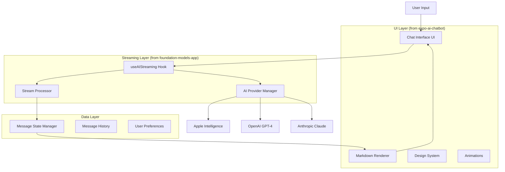

# Streaming Chat UI Integration Plan

## 1. Project Overview

This plan outlines the integration of advanced streaming chat functionality from `foundation-models-app` with the polished, modern UI design system from `expo-ai-chatbot`. The goal is to create a professional chat application that combines real-time AI streaming responses with an elegant, user-friendly interface built on NativeWind/Tailwind CSS.

## 2. Architecture Analysis

### 2.1 Foundation Models App Architecture

**Core Streaming Features:**
- `useAIStreaming` hook for real-time text streaming
- Multi-provider AI support (Apple Intelligence, OpenAI, Anthropic)
- Automatic fallback system for AI providers
- Stream cancellation and error handling
- Real-time content updates with typing indicators

**Key Technical Components:**
- AI SDK v5 integration with `streamText` function
- Provider configuration with environment-based API keys
- AbortController for stream cancellation
- Reanimated animations for keyboard handling

### 2.2 Expo AI Chatbot Architecture

**UI/UX Features:**
- Modern chat interface with message bubbles
- NativeWind/Tailwind CSS design system
- Custom markdown rendering for rich text
- Responsive design with proper keyboard handling
- Tool invocation support (weather, etc.)
- Lottie animations for loading states

**Key UI Components:**
- `ChatInterface` component with message rendering
- `CustomMarkdown` for formatted text display
- Design system with consistent theming
- Supabase integration for data persistence

## 3. Integration Strategy

### 3.1 Core Components to Extract

**From Foundation Models App:**
- `useAIStreaming.ts` - Core streaming functionality
- `ai-providers.ts` - Multi-provider configuration
- Streaming text rendering with cursor animation
- Provider fallback logic

**From Expo AI Chatbot:**
- `ChatInterface.tsx` - Modern chat UI
- `CustomMarkdown.tsx` - Rich text rendering
- UI component library (`/components/ui/`)
- NativeWind configuration and theming
- Design system and styling approach

### 3.2 Architecture Design



## 4. Technical Implementation Plan

### 4.1 Phase 1: Project Setup and Dependencies

**Step 1: Create New Project Structure**
```
streaming-chat-app/
├── src/
│   ├── components/
│   │   ├── ui/           # From expo-ai-chatbot
│   │   ├── chat/         # New chat components
│   │   └── common/       # Shared components
│   ├── hooks/
│   │   ├── useAIStreaming.ts    # From foundation-models-app
│   │   └── useChat.ts           # New enhanced chat hook
│   ├── lib/
│   │   ├── ai-providers.ts      # From foundation-models-app
│   │   ├── utils.ts             # From expo-ai-chatbot
│   │   └── constants.ts
│   ├── types/
│   │   └── chat.ts
│   └── app/
│       └── (tabs)/
│           └── chat.tsx
├── package.json
├── tailwind.config.js
└── app.json
```

**Step 2: Install Dependencies**
```json
{
  "dependencies": {
    "@ai-sdk/anthropic": "^2.0.1",
    "@ai-sdk/openai": "^2.0.9",
    "@react-native-ai/apple": "^0.4.0",
    "ai": "^5.0.9",
    "nativewind": "4.1.23",
    "tailwindcss": "^3.4.0",
    "react-native-markdown-display": "^7.0.2",
    "react-native-reanimated": "~3.17.4",
    "lottie-react-native": "7.2.2",
    "expo-router": "~5.1.4"
  }
}
```

### 4.2 Phase 2: Core Streaming Integration

**Step 3: Adapt useAIStreaming Hook**
- Enhance the hook to work with chat message format
- Add message history management
- Integrate with UI state management
- Add typing indicators and status updates

**Step 4: Create Enhanced Chat Hook**
```typescript
interface ChatMessage {
  id: string;
  role: 'user' | 'assistant';
  content: string;
  timestamp: Date;
  isStreaming?: boolean;
}

interface UseChatReturn {
  messages: ChatMessage[];
  sendMessage: (content: string) => Promise<void>;
  isStreaming: boolean;
  cancelStream: () => void;
  clearChat: () => void;
}
```

### 4.3 Phase 3: UI Component Integration

**Step 5: Adapt ChatInterface Component**
- Integrate streaming message rendering
- Add real-time content updates
- Implement typing cursor animation
- Add provider status indicators

**Step 6: Create Streaming Message Component**
```typescript
interface StreamingMessageProps {
  message: ChatMessage;
  isStreaming: boolean;
  showCursor: boolean;
}
```

**Step 7: Implement Input Component**
- Multi-line text input with proper keyboard handling
- Send/cancel button states
- Character count and input validation
- Keyboard animation integration

### 4.4 Phase 4: Advanced Features

**Step 8: Provider Management UI**
- Provider status indicators (🔒 Local, ☁️ Cloud)
- Model name display
- Connection status and error handling
- Settings screen for API key configuration

**Step 9: Message Persistence**
- Local storage for chat history
- Export/import functionality
- Message search and filtering

**Step 10: Performance Optimization**
- Message virtualization for large chat histories
- Optimized re-renders during streaming
- Memory management for long conversations

## 5. Key Integration Points

### 5.1 Streaming to UI Bridge

```typescript
// Enhanced streaming hook with UI integration
const useStreamingChat = () => {
  const [messages, setMessages] = useState<ChatMessage[]>([]);
  const { startStreaming, isStreaming, content } = useAIStreaming();
  
  const sendMessage = useCallback(async (userInput: string) => {
    // Add user message
    const userMessage: ChatMessage = {
      id: generateId(),
      role: 'user',
      content: userInput,
      timestamp: new Date()
    };
    
    setMessages(prev => [...prev, userMessage]);
    
    // Create assistant message placeholder
    const assistantMessage: ChatMessage = {
      id: generateId(),
      role: 'assistant',
      content: '',
      timestamp: new Date(),
      isStreaming: true
    };
    
    setMessages(prev => [...prev, assistantMessage]);
    
    // Start streaming
    await startStreaming({ prompt: userInput });
  }, [startStreaming]);
  
  // Update streaming message content
  useEffect(() => {
    if (content && isStreaming) {
      setMessages(prev => 
        prev.map(msg => 
          msg.isStreaming ? { ...msg, content } : msg
        )
      );
    }
  }, [content, isStreaming]);
  
  return { messages, sendMessage, isStreaming };
};
```

### 5.2 UI Component Architecture

```typescript
// Main chat screen component
const ChatScreen = () => {
  const { messages, sendMessage, isStreaming } = useStreamingChat();
  
  return (
    <View className="flex-1 bg-background">
      <ChatInterface 
        messages={messages}
        isStreaming={isStreaming}
      />
      <ChatInput 
        onSendMessage={sendMessage}
        disabled={isStreaming}
      />
    </View>
  );
};
```

## 6. Configuration Requirements

### 6.1 Environment Variables
```bash
# .env.local
EXPO_PUBLIC_OPENAI_API_KEY=your_openai_key
EXPO_PUBLIC_ANTHROPIC_API_KEY=your_anthropic_key
```

### 6.2 NativeWind Configuration
```javascript
// tailwind.config.js
module.exports = {
  content: ['./src/**/*.{js,jsx,ts,tsx}'],
  theme: {
    extend: {
      colors: {
        background: 'hsl(var(--background))',
        foreground: 'hsl(var(--foreground))',
        muted: 'hsl(var(--muted))',
        border: 'hsl(var(--border))'
      }
    }
  },
  plugins: []
};
```

## 7. Testing Strategy

### 7.1 Unit Tests
- `useAIStreaming` hook functionality
- Message state management
- Provider fallback logic
- UI component rendering

### 7.2 Integration Tests
- End-to-end chat flow
- Streaming message updates
- Error handling scenarios
- Provider switching

### 7.3 Performance Tests
- Large message history handling
- Streaming performance under load
- Memory usage optimization
- UI responsiveness during streaming

## 8. Deployment Considerations

### 8.1 Platform-Specific Features
- iOS: Apple Intelligence integration
- Android: Fallback to cloud providers
- Web: Browser compatibility for streaming

### 8.2 Security
- API key management
- Secure storage for sensitive data
- Input validation and sanitization

## 9. Future Enhancements

### 9.1 Advanced Features
- Voice input/output integration
- Image and file sharing
- Multi-modal AI interactions
- Custom AI model fine-tuning

### 9.2 UI/UX Improvements
- Dark/light theme switching
- Custom chat themes
- Message reactions and interactions
- Advanced markdown support

## 10. Success Metrics

- **Performance**: Sub-100ms response time for streaming start
- **Reliability**: 99%+ uptime with proper error handling
- **User Experience**: Smooth animations and responsive UI
- **Compatibility**: Support for iOS, Android, and Web platforms

This integration plan provides a comprehensive roadmap for combining the best of both applications while maintaining code quality, performance, and user experience standards.