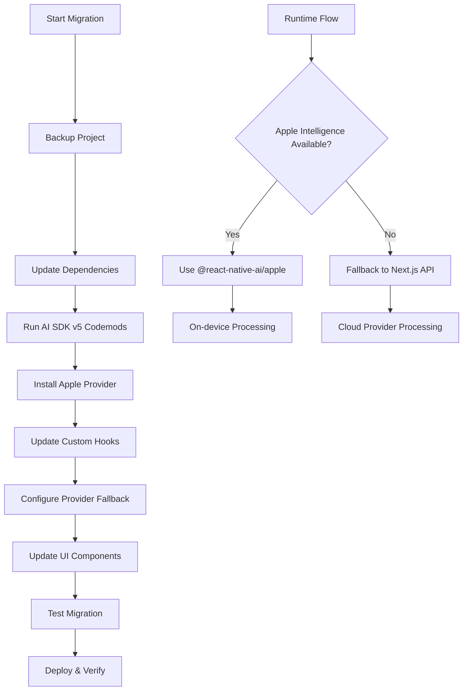

# AI SDK v5 Migration and Apple Foundation Models Integration - Product Requirements

## 1. Product Overview

This document outlines the requirements for migrating an existing Expo iOS application from a custom `expo-foundation-models` implementation to Vercel AI SDK v5 with integrated Apple Foundation Models support. The migration will modernize the AI integration architecture while adding on-device Apple Intelligence capabilities for enhanced privacy and performance.

The project consists of an Expo React Native iOS app with a custom native module for Apple Foundation Models, which needs to be replaced with the standardized AI SDK v5 and `@react-native-ai/apple` provider. This migration will provide better maintainability, feature parity with modern AI SDK capabilities, and seamless integration with both local and cloud-based AI models.

## 2. Core Features

### 2.1 User Roles

| Role | Registration Method | Core Permissions |
|------|---------------------|------------------|
| iOS App User | Device-based access | Can use all AI features including on-device Apple Intelligence |
| Developer | Development environment | Can configure and test both local and cloud AI providers |

### 2.2 Feature Module

Our migration requirements consist of the following main components:

1. **Migration Documentation**: Comprehensive step-by-step migration guide, API mapping, and troubleshooting.
2. **Technical Architecture**: Updated system design with AI SDK v5 integration and Apple Foundation Models.
3. **Implementation Examples**: Code samples for both Expo app and Next.js API server integration.
4. **Testing Strategy**: Validation approach for ensuring feature parity during migration.

### 2.3 Page Details

| Component | Module Name | Feature Description |
|-----------|-------------|--------------------|
| Migration Documentation | Step-by-step Guide | Detailed migration process from custom module to AI SDK v5, including package updates, code changes, and configuration |
| Migration Documentation | API Mapping | Complete mapping between old expo-foundation-models API and new AI SDK v5 + Apple provider API |
| Migration Documentation | Breaking Changes | Comprehensive list of breaking changes and required code modifications |
| Technical Architecture | System Design | Updated architecture diagram showing AI SDK v5 integration with Apple Foundation Models |
| Technical Architecture | Provider Configuration | Setup and configuration for @react-native-ai/apple provider |
| Technical Architecture | Fallback Strategy | Implementation of cloud provider fallback when Apple Intelligence is unavailable |
| Implementation Examples | Text Generation | Updated hooks and components using AI SDK v5 for text generation |
| Implementation Examples | Streaming Implementation | Migrated streaming functionality with new AI SDK v5 streaming API |
| Implementation Examples | Structured Output | Updated structured data generation using Zod schemas |
| Implementation Examples | Next.js Integration | API server implementation for cloud provider fallback |

## 3. Core Process

**Migration Flow:**
Developers will follow a systematic migration process starting with dependency updates, followed by code migration using automated codemods where possible, manual API updates, testing, and finally deployment verification.

**Implementation Flow:**
The new architecture will first attempt to use Apple Foundation Models for on-device processing, with automatic fallback to cloud providers through the Next.js API server when Apple Intelligence is unavailable or insufficient for the task.

## 4. User Interface Design

### 4.1 Design Style

- **Primary Colors**: Maintain existing app theme with iOS system colors for Apple Intelligence features
- **Button Style**: Native iOS styling with system blur effects for AI-powered features
- **Font**: SF Pro system font family with dynamic type support
- **Layout Style**: Card-based design with native iOS navigation patterns
- **Icons**: SF Symbols for AI-related features, maintaining consistency with Apple's design language

### 4.2 Page Design Overview

| Component | Module Name | UI Elements |
|-----------|-------------|-------------|
| Migration Guide | Documentation Pages | Clean markdown rendering with syntax-highlighted code blocks, step-by-step navigation |
| Architecture Diagrams | System Design | Interactive Mermaid diagrams with hover states and detailed component descriptions |
| Code Examples | Implementation Samples | Syntax-highlighted TypeScript/React Native code with copy-to-clipboard functionality |
| Testing Interface | Validation Tools | Simple form inputs for testing AI functionality with real-time response display |

### 4.3 Responsiveness

The documentation is designed to be accessible across desktop and mobile devices, with responsive layouts for reading on various screen sizes. The implementation examples are optimized for iOS devices with proper touch interactions and native feel.