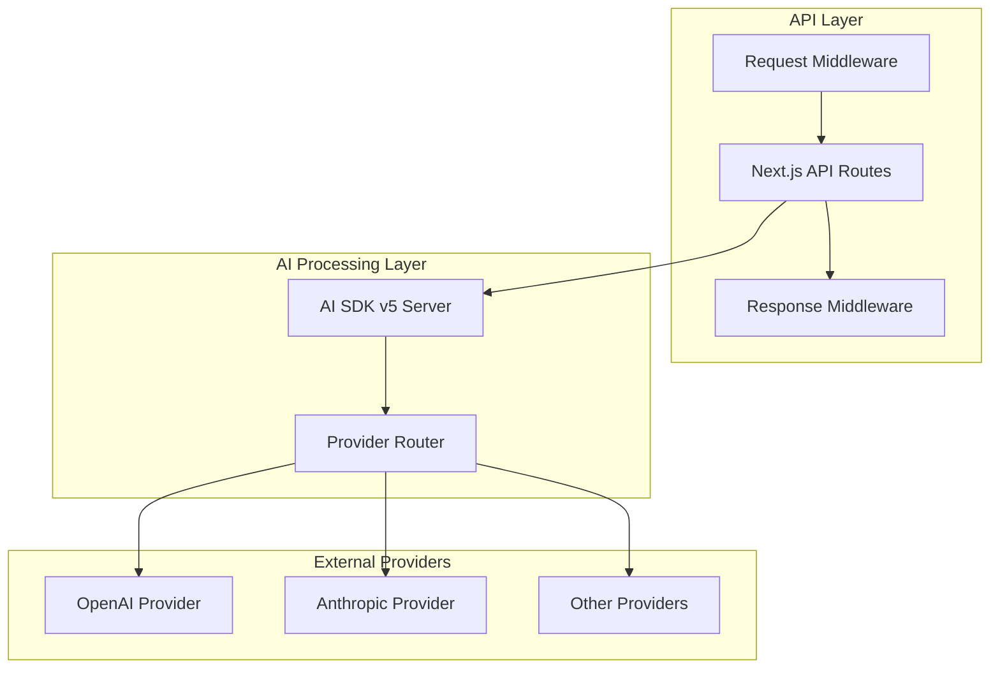
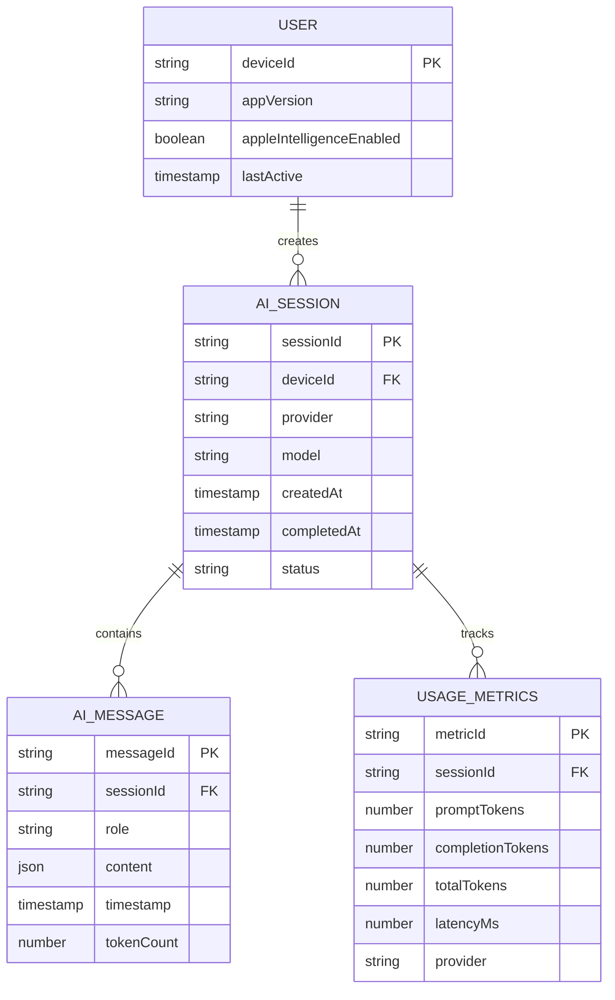

# AI SDK v5 Migration - Technical Architecture Document

## 1. Architecture Design

```mermaid
graph TD
    A[iOS Expo App] --> B[AI SDK v5 Core]
    B --> C[@react-native-ai/apple Provider]
    B --> D[HTTP Client]
    C --> E[Apple Foundation Models]
    D --> F[Next.js API Server]
    F --> G[Cloud AI Providers]
    
    subgraph "Mobile Layer (iOS)"
        A
        B
        C
    end
    
    subgraph "On-Device AI"
        E
    end
    
    subgraph "Backend Layer"
        F
        G
    end
    
    subgraph "External Services"
        H[OpenAI API]
        I[Anthropic API]
        J[Other Providers]
    end
    
    G --> H
    G --> I
    G --> J
```

## 2. Technology Description

* **Frontend**: React Native 0.79.5 + Expo 53 + AI SDK v5 + @react-native-ai/apple

* **Backend**: Next.js API routes with AI SDK v5 server components

* **AI Providers**: Apple Foundation Models (on-device) + OpenAI/Anthropic (cloud fallback)

* **Schema Validation**: Zod v3.25.0+

* **Development**: TypeScript, ESLint, Expo Dev Client

## 3. Route Definitions

| Route                 | Purpose                                                           |
| --------------------- | ----------------------------------------------------------------- |
| /                     | Home screen with AI feature selection                             |
| /basic-generation     | Simple text generation using Apple Intelligence or cloud fallback |
| /streaming-chat       | Real-time chat interface with streaming responses                 |
| /streaming-structured | Structured data generation with live updates                      |
| /structured-data      | Static structured output generation                               |
| /settings             | Provider configuration and fallback settings                      |

## 4. API Definitions

### 4.1 Core API

**Text Generation**

```typescript
// AI SDK v5 Unified Interface
import { generateText } from 'ai';
import { apple } from '@react-native-ai/apple';

const result = await generateText({
  model: apple(),
  prompt: 'Explain quantum computing',
  maxOutputTokens: 1000
});
```

**Streaming Text Generation**

```typescript
import { streamText } from 'ai';
import { apple } from '@react-native-ai/apple';

const stream = await streamText({
  model: apple(),
  messages: [{ role: 'user', content: 'Write a story' }]
});

for await (const chunk of stream.textStream) {
  console.log(chunk);
}
```

**Structured Output Generation**

```typescript
import { generateObject } from 'ai';
import { apple } from '@react-native-ai/apple';
import { z } from 'zod';

const schema = z.object({
  name: z.string(),
  price: z.number(),
  category: z.string()
});

const result = await generateObject({
  model: apple(),
  schema,
  prompt: 'Generate a product'
});
```

### 4.2 Provider Fallback API

**Next.js API Route for Cloud Fallback**

```
POST /api/ai/generate
```

Request:

| Param Name | Param Type | isRequired | Description               |
| ---------- | ---------- | ---------- | ------------------------- |
| prompt     | string     | true       | The user prompt           |
| model      | string     | false      | Preferred cloud model     |
| maxTokens  | number     | false      | Maximum output tokens     |
| stream     | boolean    | false      | Enable streaming response |

Response:

| Param Name | Param Type | Description               |
| ---------- | ---------- | ------------------------- |
| text       | string     | Generated text response   |
| usage      | object     | Token usage information   |
| model      | string     | Model used for generation |

Example Request:

```json
{
  "prompt": "Explain machine learning",
  "model": "gpt-4",
  "maxTokens": 500,
  "stream": false
}
```

Example Response:

```json
{
  "text": "Machine learning is a subset of artificial intelligence...",
  "usage": {
    "promptTokens": 10,
    "completionTokens": 150,
    "totalTokens": 160
  },
  "model": "gpt-4"
}
```

## 5. Server Architecture Diagram



## 6. Data Model

### 6.1 Data Model Definition



### 6.2 Data Definition Language

**Local Storage Schema (AsyncStorage/MMKV)**

```typescript
// User Preferences
interface UserPreferences {
  preferredProvider: 'apple' | 'cloud';
  fallbackEnabled: boolean;
  maxTokens: number;
  temperature: number;
}

// Session Cache
interface SessionCache {
  sessionId: string;
  messages: AIMessage[];
  provider: string;
  model: string;
  createdAt: string;
}

// Usage Metrics
interface UsageMetrics {
  totalSessions: number;
  appleIntelligenceUsage: number;
  cloudFallbackUsage: number;
  averageLatency: number;
  lastUpdated: string;
}
```

**Migration Data Mapping**

```typescript
// Old expo-foundation-models types -> New AI SDK v5 types
interface MigrationMapping {
  // Old: GenerationRequest -> New: generateText params
  oldGenerationRequest: {
    prompt: string;
  };
  newGenerateTextParams: {
    model: any;
    prompt: string;
    maxOutputTokens?: number;
  };
  
  // Old: StreamingChunk -> New: StreamTextResult
  oldStreamingChunk: {
    content: string;
    isComplete: boolean;
    tokenCount: number;
    sessionId: string;
  };
  newStreamChunk: {
    type: 'text-delta' | 'finish';
    textDelta?: string;
    usage?: {
      promptTokens: number;
      completionTokens: number;
    };
  };
}
```

**Provider Configuration**

```typescript
// Apple Provider Setup
const appleProvider = apple({
  // Apple Foundation Models don't require API keys
  // Configuration is handled by the native module
});

// Cloud Provider Fallback
const openaiProvider = openai({
  apiKey: process.env.OPENAI_API_KEY,
  baseURL: process.env.OPENAI_BASE_URL
});

// Provider Selection Logic
const selectProvider = async () => {
  const isAppleAvailable = await checkAppleIntelligenceAvailability();
  return isAppleAvailable ? appleProvider : openaiProvider;
};
```

